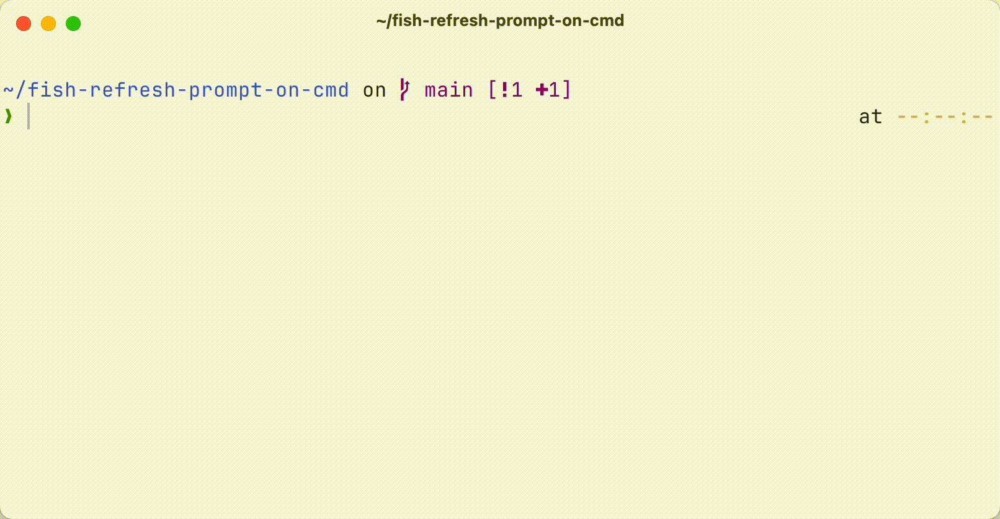

# fish-refresh-prompt-on-cmd

This plugin refreshes your (previous) prompt when you enter a new command.



In the above video, you can notice...

- The time on the right was updated before the command was executed-- reflecting the actual time the command was executed
- The git status was updated... The `[!1 +1]` (1 modified, 1 untracked file) was updated to `[●6]` (6 staged files)
- After the long-running command, the command duration was shown
- After each command, first a quick prompt without git state is rendered and later the git state pops in (thanks to [@acomagu's fish-async-prompt plugin](https://github.com/infused-kim/fish-async-prompt/))

**But why would you want that?**

Over the past decade, prompts have evolved to show an incredible amount of information, such as time, git status, dev environment, etc.

But the prompt is rendered after the previous command has finished. That's fantastic if you are actively working on something in the terminal.

However, if you take a break, make changes in another terminal tab, in your code editor, or in a graphical git GUI, and then come back to your terminal, the prompt will display outdated information.

This is particularly annoying when you need to read over the terminal history to understand when commands were executed and how long they took.

**How this plugin solves the problem**

This plugin causes the prompt to be repainted before a new command is executed.

It should work with all fish prompts, but it has been designed specifically to work with the amazing [starship prompt](https://starship.rs) and the [fish-async-prompt plugin](https://github.com/infused-kim/fish-async-prompt/) for the highest level of customization and performance.

You can find instructions on how to set up all three tools below.

## Table Of Contents

- [1. Instructions](#1-instructions)
  - [1.1. Installation](#11-installation)
  - [1.2. Usage](#12-usage)
    - [1.2.1. What to expect](#121-what-to-expect)
    - [1.2.2. What to do if the prompt is not refreshing](#122-what-to-do-if-the-prompt-is-not-refreshing)
    - [1.2.3. How to enable debug logging](#123-how-to-enable-debug-logging)
    - [1.2.4. How to configure your prompt to use `rpoc_time`](#124-how-to-configure-your-prompt-to-use-rpoc_time)
    - [1.2.5. How to change the prompt output when the prompt is refreshing](#125-how-to-change-the-prompt-output-when-the-prompt-is-refreshing)
    - [1.2.6. How to disable the automatic time right prompt](#126-how-to-disable-the-automatic-time-right-prompt)
    - [1.2.7. How to disable refreshing on the left or right side](#127-how-to-disable-refreshing-on-the-left-or-right-side)
    - [1.2.8. How to customize the time prompt](#128-how-to-customize-the-time-prompt)
    - [1.2.9. How to customize the command duration prompt](#129-how-to-customize-the-command-duration-prompt)
- [2. Ideal setup with starship prompt, fish-async-prompt, and fish-refresh-prompt-on-cmd](#2-ideal-setup-with-starship-prompt-fish-async-prompt-and-fish-refresh-prompt-on-cmd)
  - [2.1. Set up starship prompt](#21-set-up-starship-prompt)
  - [2.2. Set up fish-async-prompt to speed up starship with async magic](#22-set-up-fish-async-prompt-to-speed-up-starship-with-async-magic)
  - [2.3. Make the prompt refresh faster](#23-make-the-prompt-refresh-faster)
- [3. Troubleshooting](#3-troubleshooting)
  - [3.1. Understand how fish prompts work](#31-understand-how-fish-prompts-work)
  - [3.2. Understand how fish-async-prompt works](#32-understand-how-fish-async-prompt-works)
  - [3.3. Understand how fish-refresh-prompt-on-cmd works](#33-understand-how-fish-refresh-prompt-on-cmd-works)
  - [3.4. How to enable debug logging to investigate the issue](#34-how-to-enable-debug-logging-to-investigate-the-issue)
  - [3.5. Make sure you are using compatible versions of the plugins](#35-make-sure-you-are-using-compatible-versions-of-the-plugins)
  - [3.6. Investigate the plugin loading order](#36-investigate-the-plugin-loading-order)
  - [3.7. If it's still not working...](#37-if-its-still-not-working)
- [4. Known Issues](#4-known-issues)
  - [4.1. fish-async-prompt sometimes not repainting](#41-fish-async-prompt-sometimes-not-repainting)


## 1. Instructions

### 1.1. Installation

Install with [fisher](https://github.com/jorgebucaran/fisher):

```fish
fisher install infused-kim/fish-refresh-prompt-on-cmd
```

But it's recommended to pin a specific version to ensure future updates don't break compatibility. You can [check the tags for the latest version](https://github.com/infused-kim/fish-refresh-prompt-on-cmd/tags) and then install with:

```fish
fisher install infused-kim/fish-refresh-prompt-on-cmd@vX.Y
```

Alternatively, you can install it manually by copying the [conf.d/1000-refresh-prompt-on-cmd.fish](conf.d
/1000-refresh-prompt-on-cmd.fish) to your `~/.config/fish/conf.d/` directory.

> [!IMPORTANT]
> If you are using this plugin together with `fish-async-prompt`, then `fish-refresh-prompt-on-cmd` needs to be loaded _AFTER_ `fish-async-prompt`. The default names of the files, `__async_prompt.fish` and `_refresh_prompt_on_cmd.fish` (notice the `_` vs the `__`), ensure this. But if you need to make sure they are loaded in the correct order.


### 1.2. Usage

#### 1.2.1. What to expect

Open a new shell to load the plugin and the prompt should start refreshing automatically when you press `enter`.

But it might be hard to notice the difference. If you are using a prompt that shows the git state, you can cd into a git repo, modify the git state in another terminal tab, and then come back to your previous shell to see the git state update when you enter the next command.

You can also execute `sleep 4` to see command duration.

#### 1.2.2. What to do if the prompt is not refreshing

This plugin should work without any changes with any prompt that uses the `fish_prompt` and `fish_right_prompt` functions. But some prompts may do some "magic" that interferes with this plugin. This is most likely to happen with prompts that generate the prompt "asynchronously" or mention that they are "highly performant".

This plugin may need to be modified to accommodate the magic these prompts are doing (which I am, unfortunately, unlikely to do since I don't use these prompts).

Try disabling your current prompt and check if the refresh works with the default fish prompt to verify that the plugin is set up correctly.

After that, I would suggest trying the [starship](https://starship.rs) prompt and the [fish-async-prompt](https://github.com/infused-kim/fish-async-prompt/) plugin because this plugin is designed to work with them. Starship is extremely customizable and combined with the fish-async-prompt plugin it provides excellent performance.

You can find detailed instructions below.

#### 1.2.3. How to enable debug logging

If you wish to debug the plugin, you can enable debug logging with:

```fish
# Enable debug logging
set -g rpoc_debug_log_enabled 1
set -g rpoc_debug_log_path $HOME/.cache/fish/fish_refresh_prompt_on_cmd.log
```

Check the troubleshooting section below for a lot more details.

> [!IMPORTANT]
> Please be aware, that when the debug logs are enabled, it might cause the async-prompt to not repaint after the background process finishes. See the known issues section for more details and a workaround.

#### 1.2.4. How to configure your prompt to use `rpoc_time`

Consult your prompt's documentation on how to add a custom module or prompt item.

You could also define a `fish_right_prompt` function. That's what your prompt is doing under the hood.

```fish
function fish_right_prompt
    rpoc_time
end
```

You can add this function to a file in your `~/.config/fish/conf.d/` directory to make it automatically load when you open a new shell. I suggest `05-init-prompt.fish` or similar so that you can easily control the order in which your config files are loaded.

Be mindful that the last defined `fish_right_prompt` function will be the one that is displayed in the terminal. So, if another file loads after yours, it might override your function.

This plugin backs up your prompt functions to `__rpoc_orig_fish_prompt` and `__rpoc_orig_fish_right_prompt` and then replaces them with new functions that handle the refresh magic.

You can check what the original prompt function is by running `functions __rpoc_orig_fish_prompt` and `functions __rpoc_orig_fish_right_prompt`.

#### 1.2.5. How to change the prompt output when the prompt is refreshing

In your prompt rendering functions (`fish_prompt` and `fish_right_prompt`), you can check the `rpoc_is_refreshing` variable. It will be `1` when the prompt is refreshing after you press enter and `0` when a regular prompt is rendered.

You can try this with the built-in `rpoc_time` function. Run it with `rpoc_is_refreshing=1 rpoc_time` and `rpoc_is_refreshing=0 rpoc_time` to see the difference.

#### 1.2.6. How to disable the automatic time right prompt

If your shell has no right prompt enabled, then `rpoc_time` is automatically configured as your right prompt.

You can disable this behavior with `set -g rpoc_time_prompt_disabled 1`.

#### 1.2.7. How to disable refreshing on the left or right side

The prompt is refreshed synchronously before every new command. If your prompt is slow, this might add some latency to your shell.

You can disable the refreshing on the left or right side with these settings:

```fish
# Disable prompt refreshing
set -g rpoc_disable_refresh_left 1
set -g rpoc_disable_refresh_right 1
```

For example, if you don't care about refreshing the git state on your prompt and only want to refresh the time, you could put the git state on the left side, the time on the right side, and then disable the left side refresh.

#### 1.2.8. How to customize the time prompt

You can customize the time prompt with these settings:

```fish
# Time prompt customization
# Can be tested in the terminal with
# `rpoc_is_refreshing=1 rpoc_time`
set -g rpoc_time_color yellow
set -g rpoc_time_prefix 'at '
set -g rpoc_time_prefix_color normal
set -g rpoc_time_postfix ''
set -g rpoc_time_postfix_color normal
```

#### 1.2.9. How to customize the command duration prompt

You can customize the command duration prompt with these settings:

```fish
# Cmd duration customization
# Can be tested in the terminal with `rpoc_cmd_duration 5000`
set -g rpoc_cmd_duration_disabled 0
set -g rpoc_cmd_duration_min_ms 3000
set -g rpoc_cmd_duration_color yellow
set -g rpoc_cmd_duration_prefix '⌛ took '
set -g rpoc_cmd_duration_prefix_color normal
set -g rpoc_cmd_duration_postfix ''
set -g rpoc_cmd_duration_postfix_color normal
```

## 2. Ideal setup with starship prompt, fish-async-prompt, and fish-refresh-prompt-on-cmd

In this section I will show you how to make [starship prompt](https://starship.rs), [fish-async-prompt](https://github.com/infused-kim/fish-async-prompt/), and this plugin work perfectly together for the best terminal experience.

### 2.1. Set up starship prompt

Starship is a highly customizable prompt that is designed to work with any shell. This means you can use it with fish, but if you ever need to switch to another shell, you can continue using it.

Follow the instructions on the [starship website](https://starship.rs/guide/#installation) to install it.

Next, create the starship config file `~/.config/starship.toml` file.

Inside, you can customize almost every aspect of starship. Check the [starship config documentation](https://starship.rs/config/) for a full list of settings you can change and the [starship presets](https://starship.rs/presets/) for inspiration.

But for now, let's create a basic config that only includes the things we need for our setup.

```toml
# Default starship config that includes slow items like git status, python
# version, etc.

# Get editor completions based on the config schema
"$schema" = 'https://starship.rs/config-schema.json'

# Left prompt
format = """
$username\
$hostname\
$directory\
$git_branch\
$git_status\
$all\
$line_break\
$sudo\
$shell\
$character"""

# Right prompt
right_format = "${custom.rpoc_time}"


[cmd_duration]
disabled=true


[time]
disabled = true


# Custom module that runs the refresh-prompt-on-cmd time command which shows
# the time when refreshing and `at --:--:--` when not refreshing.
[custom.rpoc_time]
style = "normal"
when = true
format = '[$output]($style)'

# Whenever a custom command is run, starship executes the command in a new
# shell. If you have a lot of plugins and functions, this can significantly
# impact how long the module takes to run (and therefore delay the execution
# of the next command).
#
# Using `fish -N` causes fish to not load any config files, but then we need
# to manually load _refresh_prompt_on_cmd.fish file to make the `rpoc_time`
# command available in that shell.
#
# Ensure the path matches the path to the script on your system or the output
# will be empty.
#
# You can test it with `starship module custom.rpoc_time`.
shell = ["fish", "-N"]
command = """
    source ~/.config/fish/conf.d/_refresh_prompt_on_cmd.fish && rpoc_time
"""


[custom.rpoc_debug]
disabled = true
style = "normal"
when = true
format = '[$output]($style)'
shell = ["fish", "-N"]
command = """
    echo "rpoc_is_refreshing: $rpoc_is_refreshing "
"""
```

The prompt won't display in your shell yet because we haven't set up fish to use starship yet.

But you can test the prompt by running `starship prompt` and `starship prompt --right`. You can also test individual modules with `starship module directory` or `starship module custom.rpoc_time`.

Next, we need to set up fish to use starship. The starship docs recommend loading the starship prompt in your `~/.config/fish/config.fish` file. Personally, I prefer to load it through the `~/.config/fish/conf.d/` directory. It allows you to split your config into multiple files and load them in a specific order.

For example, I have the following files in my `~/.config/fish/conf.d/` directory:
- `00-init-path.fish`
- `01-init-env.fish`
- `05-init-prompt.fish` <-- This is where I keep all my prompt-related settings
- `06-init-aliases.fish`

So, create a file like `05-init-prompt.fish` and add the following:

```fish
#
# General
#

# Disable new user greeting
set fish_greeting


#
# Starship
#

# Initialize starship
# Config is handled in `~/.config/starship.toml`
starship init fish | source


#
# Refresh prompt on command line enter
#

# Disable prompt refreshing
# set -g rpoc_disabled 1

# Enable debug logging
# set -g rpoc_debug_log_enabled 1
# set -g rpoc_debug_log_path $HOME/.cache/fish/fish_refresh_prompt_on_cmd.log
# set -g rpoc_debug_log_path $HOME/.cache/fish/async_prompt_debug.log

# Disable prompt refreshing
# set -g rpoc_disable_refresh_left 1
# set -g rpoc_disable_refresh_right 1

# If no right prompt exists, rpoc adds the time as the right prompt.
# This setting disables this behavior.
# set -g rpoc_time_prompt_disabled 1

# Time prompt customization
# Can be tested in the terminal with
# `rpoc_is_refreshing=1 rpoc_time`
# set -g rpoc_time_color yellow
# set -g rpoc_time_prefix 'at '
# set -g rpoc_time_prefix_color normal
# set -g rpoc_time_postfix ''
# set -g rpoc_time_postfix_color normal

# Cmd duration customization
# Can be tested in the terminal with `rpoc_cmd_duration 5000`
# set -g rpoc_cmd_duration_disabled 0
# set -g rpoc_cmd_duration_min_ms 3000
# set -g rpoc_cmd_duration_color yellow
# set -g rpoc_cmd_duration_prefix '⌛ took '
# set -g rpoc_cmd_duration_prefix_color normal
# set -g rpoc_cmd_duration_postfix ''
# set -g rpoc_cmd_duration_postfix_color normal
```

Open a new shell and you should see a basic prompt. When you enter a new command, the time in the right prompt should update.

Try to navigate to a git repo and see the git status in the prompt.

### 2.2. Set up fish-async-prompt to speed up starship with async magic

Congrats! At this point, you should have a beautiful and productive prompt using starship.

Starship is amazing, but some of the modules can be a bit slow. You can measure how long your prompt takes to render with `time fish_prompt` and `time fish_right_prompt`.

This works no matter what prompt you are using, but starship offers additional commands to help you investigate the performance, such as `starship timings` and `starship explain`.

For example, here is the output of `starship timings` in a medium-sized git repo:

```shell
❯ starship timings

 Here are the timings of modules in your prompt (>=1ms or output):
 python            -  62ms  -   "via 🐍 v3.11.9 "
 git_status        -  44ms  -   "[+⇣] "
 custom.rpoc_time  -   4ms  -   "at --:--:--"
 character         -  <1ms  -   "❯ "
 directory         -  <1ms  -   "airflow "
 git_branch        -  <1ms  -   "on  main "
 line_break        -  <1ms  -   "\n"
```

As you can see, the `python` and `git_status` modules take over 100ms together.

You might think that 100ms is not that bad. After all, that's barely 1/10th of a second, but let me tell you... it IS not only noticeable, but also quite annoying... at least to me.

And keep in mind that 100ms is how long it takes on a modern and fairly fast machine (M1 Mac). If you sync your shell settings to slower machines, such as slow VPS, Raspberry Pi, etc., then the delay will be more pronounced.

On my slowish VPS, the delay increases to over 200ms, for example.

Whether this is a problem for you, is up to you. If you don't mind the tiny bit of sluggishness, then you can stop here and be happy with your new prompt.

**But if you have the need for speed, then...**

Let's fix the slow prompt by using the [fish-async-prompt](https://github.com/infused-kim/fish-async-prompt/) plugin.

This plugin will help us display a minimal prompt immediately, render the full prompt in the background, and then refresh the prompt once the background process finishes. But your prompt will appear nearly instantly and you will be able to start typing the next command right away.

It was created by [@acomagu](https://github.com/acomagu/fish-async-prompt), but it required a few changes to make it compatible with this plugin. Therefore, for now [you must use my fork which you can find here](https://github.com/infused-kim/fish-async-prompt/).

You can install it with [fisher](https://github.com/jorgebucaran/fisher):

```fish
fisher install infused-kim/fish-async-prompt
```

Or manually by copying the [__async_prompt.fish](https://github.com/infused-kim/fish-async-prompt/blob/v1.2.0/conf.d/__async_prompt.fish) file into your `~/.config/fish/conf.d/` directory.

> [!IMPORTANT]
> One important detail is that `fish-refresh-prompt-on-cmd` needs to be loaded _AFTER_ `fish-async-prompt`. The default names of the files, `__async_prompt.fish` and `_refresh_prompt_on_cmd.fish` (notice the `_` vs the `__`), ensure this. But if you need to make sure they are loaded in the correct order.

But before you install it, make sure to run `time fish_prompt` while you are in a git repo. Note how long it takes to render the prompt.

After installing it, open a new shell to reload your config and it should start working right away.

But it might be difficult to notice a difference without direct comparison. So, run `time fish_prompt` again and compare the time. Your previous time would have likely been somewhere around 100ms, but now it should be less than 5ms... **a 20x improvement!**

Now, try to enter `cd some_sub_dir` and pay close attention to the prompt.

What you will notice is that the previous directory is displayed first and after a short delay the correct directory pops in.

That's because out-of-the-box, fish-async-prompt displays your previous prompt while it's generating the new prompt in the background. Your prompt is a bit of a liar right now...

But don't worry, with a little bit of additional configuration, we will make an honest couple out of starship and fish-async-prompt.

We will create a second starship config in `~/.config/starship-minimal.toml` that displays only the most essential and very fast prompt elements. And we'll tell fish-async-prompt to show that prompt while the full prompt is loading in the background.

The end result is that when you press enter, you will see the minimal, but fast and honest prompt first. And after a short moment, the full prompt will pop in.

First, copy your current starship config to the `~/.config/starship-minimal.toml` file with:

```shell
cp ~/.config/starship.toml ~/.config/starship-minimal.toml
```

Next, edit the `~/.config/starship-minimal.toml` file and change the `format` and `right_format` to only include the most essential and fast prompt elements.

```toml
format = """
$username\
$hostname\
$directory\
$git_branch\
$line_break\
$sudo\
$shell\
$character"""

right_format = ""
```

Notice how the new list doesn't include `$git_status` and `$all` anymore.

You can test the new prompt with `STARSHIP_CONFIG=~/.config/starship-minimal.toml starship prompt`.

Next, edit your `~/.config/fish/conf.d/05-init-prompt.fish` file and add:

```fish
#
# Async Prompt
#

# Setup the synchronous prompt that is displayed immediately while the async
# prompt is loading.
set -g STARSHIP_CONFIG_MINIMAL $HOME/.config/starship-minimal.toml

function fish_prompt_loading_indicator
 STARSHIP_CONFIG=$STARSHIP_CONFIG_MINIMAL starship prompt
end

function fish_prompt_right_loading_indicator
 STARSHIP_CONFIG=$STARSHIP_CONFIG_MINIMAL starship prompt --right
end

# Disable async prompt
# set -g async_prompt_enable 0
```

Open a new shell and you should see the minimal prompt displayed immediately.

After a short moment, the full prompt will pop in.

### 2.3. Make the prompt refresh faster

There are two more things that we can do to make the prompt a bit faster.

When the prompt is refreshing after you press enter, the command is not executed until the prompt is fully refreshed. Even with `fish-async-prompt`, that part is still synchronous.

On fast computers, this is barely noticeable, but on slower machines, it can add a noticeable delay to the command execution. If you are bothered by this, here's how you can fix it.

The first issue is that custom modules in starship are executed in a new shell that needs to be loaded first.

Take a look at the output of `starship timings` in the example below when I run it on my slow VPS. The `custom.rpoc_time` module takes `137ms` to run.

```shell
Kim @ slow-vps in ~
❯ starship timings

 Here are the timings of modules in your prompt (>=1ms or output):
 custom.rpoc_time  -  137ms  -   "at --:--:--"
 sudo              -   26ms  -   "🧙 "
 character         -   <1ms  -   "❯ "
 directory         -   <1ms  -   "~ "
 hostname          -   <1ms  -   "@ infused-insight-01 in "
 line_break        -   <1ms  -   "\n"
 username          -   <1ms  -   "Kim "
```

Now, take a look at how long it takes to run the `rpoc_time` function directly and without starship...

```shell
Kim @ slow-vps in ~
❯ time rpoc_time
at --:--:--
________________________________________________________
Executed in    1.54 millis    fish           external
   usr time  621.00 micros  621.00 micros    0.00 micros
   sys time    0.00 micros    0.00 micros    0.00 micros
```

Only `1.54ms`! That's 89x faster!

If you, like me, keep the time in your right prompt, it's very easy to fix. Instead of using starship for your right prompt, you can just create a custom `fish_right_prompt` function that runs the `rpoc_time` function directly.

Simply add the following to your `~/.config/fish/conf.d/05-init-prompt.fish` file anywhere after the `starship init fish | source` line:

```fish
function fish_right_prompt
    rpoc_time
end
```

The second issue is that the left prompt is also run asynchronously before the command is executed and it contains the slow modules like git status. If it's important for you to be able to see the refreshed git status at the time the command was executed, then perhaps the small slowdown is worth it for you.

But if it's _not_ important to you and you only care about the time at which the command was executed, then you can disable the left prompt refresh with `set -g rpoc_disable_refresh_left 1` in your `~/.config/fish/conf.d/05-init-prompt.fish` file.

You can also disable the right prompt refresh with `set -g rpoc_disable_refresh_right 1`.

## 3. Troubleshooting

If something is not working as expected, here are some pointers on how you can debug and investigate the issue.

The first step is for you to...

### 3.1. Understand how fish prompts work

In fish changing the prompt is very easy. You just define a `fish_prompt` and the output of it will be displayed as the main, left prompt. The output of the `fish_right_prompt` function will be displayed as the right prompt.

You can check the code of the current prompt with `functions fish_prompt` and `functions fish_right_prompt`.

And you can override your prompt by simply defining a new `fish_prompt` function. You can even paste the following code into your fish terminal to test it:

```fish
function fish_right_prompt
 echo "Hello, prompt!"
end
```

In addition to these functions, fish also offers a few other useful things that we can take advantage of, such as events:

- `fish_preexec` is fired before a command is executed
- `fish_postexec` is fired after a command is executed
- `fish_prompt` is fired before the prompt is displayed

And `commandline -f repaint` can be used to ask fish to repaint the prompt immediately.

### 3.2. Understand how fish-async-prompt works

Fish-async-prompt subscribes to the `fish_prompt` event that is called before the prompt is displayed. It generates an initial prompt synchronously using the `fish_prompt_loading_indicator` function and stores the output in a temporary file. At the same time, it launches a background process that generates the full prompt.

It also overwrites the `fish_prompt` and `fish_right_prompt` functions to not generate the prompt, but instead to simply `cat` the temporary file where the prompt is stored.

The `fish_prompt` and `fish_right_prompt` are called immediately after the `fish_prompt` event is fired and by that time the temporary file contains the initial prompt.

When the background process finishes generating the full prompt it also stores it in the temporary file. Then it sends a signal to the parent fish process, which executes the `commandline -f repaint` command in response.

Fish calls the `fish_prompt` and `fish_right_prompt` functions again in response to the `repaint` command and they `cat` the full prompt from the temporary file.

This works because the `fish_prompt` event (not function) is only fired when the prompt is first displayed. It's not fired when the prompt is repainted due to the `commandline -f repaint` command.

I added detailed comments on how everything works in [my fork of the fish-async-prompt plugin here](https://github.com/infused-kim/fish-async-prompt/blob/master/conf.d/__async_prompt.fish) if you want to learn more.

One important thing is that the `fish_prompt` and `fish_right_prompt` are only replaced in interactive shells. But the background process is a non-interactive shell where the original functions are present and therefore generate the original prompt output.

My fork of `fish-async-prompt` backs up the original prompt functions to `__async_prompt_orig_fish_prompt` and `__async_prompt_orig_fish_right_prompt` and this is required for `fish-refresh-prompt-on-cmd` to work with it.

### 3.3. Understand how fish-refresh-prompt-on-cmd works

The idea of this plugin is quite simple...

- Detect when a command is entered
- Set a variable `rpoc_is_refreshing` to 1 to allow the prompt functions to determine whether the prompt is being rendered for the first time or refreshing
- Ask fish to repaint the prompt
- Wait for the repaint to finish to set `rpoc_is_refreshing` back to 0
- Execute the command

That sounds easy enough, right? The `fish_preexec`, and `fish_postexec` events seem perfect for the job.

Unfortunately, reality is a bit more complicated.

The `commandline -f repaint` command doesn't work in `fish_preexec`. So, this event can't be used to trigger the repaint at all.

On top of that the `fish_postexec` and `fish_preexec` events are not fired when an empty command is entered and therefore can't even be used to reset the `rpoc_is_refreshing` variable back to 0.

Instead, I am using a bit of a hack...

- I backup the current `fish_prompt` and `fish_right_prompt` functions to `__rpoc_orig_fish_prompt` and `__rpoc_orig_fish_right_prompt` and replace them with my own functions
- I bind a function to be executed when the `enter` key is pressed.
- There I set `rpoc_is_refreshing` to 1
- Then I ask fish to repaint the prompt
- Fish calls my replacement `fish_prompt` and `fish_right_prompt` functions where I call the backed-up, original functions
- At the end of `fish_right_prompt` I set `rpoc_is_refreshing` back to 0
- Then the command is executed

It's not possible to refresh the prompt asynchronously because by the time the background process finishes, the next command might already be finished and the repaint would repaint the new prompt instead of the previous one.

So, when an async prompt is used, it's necessary to have a backup of the original prompt function and call those in `fish_prompt` and `fish_right_prompt` instead of the ones that generate the prompt asynchronously.

That's why async prompts like [tide](https://github.com/IlanCosman/tide) and [hydro](https://github.com/jorgebucaran/hydro) likely won't work with `fish-refresh-prompt-on-cmd` (but I haven't tested it as I don't use those prompts).

And for more details, you can check out the detailed comments in the [conf.d/_refresh_prompt_on_cmd.fish](conf.d/_refresh_prompt_on_cmd.fish) code.

### 3.4. How to enable debug logging to investigate the issue

My fork of `fish-async-prompt` adds debug logging and you can enable both with...

```fish
# Enable rpoc debug logging
set -g rpoc_debug_log_enabled 1
set -g rpoc_debug_log_path $HOME/.cache/fish/prompt_debug.log

# Enable async-prompt debug logging
set -g async_prompt_debug_log_enable 1
set -g async_prompt_debug_log_path $HOME/.cache/fish/prompt_debug.log
```

After that, you can see what's going on with `tail -f $HOME/.cache/fish/prompt_debug.log`.

> [!IMPORTANT]
> Please be aware, that when the debug logs are enabled, it might cause the async-prompt to not repaint after the background process finishes. See the known issues section for more details and a workaround.

### 3.5. Make sure you are using compatible versions of the plugins

For `fish-refresh-prompt-on-cmd` to work with `fish-async-prompt`, you must use a version that backs up the original prompt functions. My fork does this and I have submitted a PR to [@acomagu/fish-async-prompt](https://github.com/acomagu/fish-async-prompt) to add this feature, but it may not have been merged yet (and it may never get merged).

### 3.6. Investigate the plugin loading order

Another likely cause of issues is that the `fish-async-prompt` and `fish-refresh-prompt-on-cmd` plugins overwrite the prompt functions in the wrong order.

The `fish-refresh-prompt-on-cmd` plugin must be loaded after the `fish-async-prompt` plugin.

You can inspect all of the functions with:

```fish
functions fish_prompt
functions fish_right_prompt
functions __rpoc_orig_fish_prompt
functions __rpoc_orig_fish_right_prompt
functions __async_prompt_orig_fish_prompt
functions __async_prompt_orig_fish_right_prompt
```

The correct output should be...
- `fish_prompt` and `fish_right_prompt` contain the `fish-refresh-prompt-on-cmd` functions
- `__rpoc_orig_fish_prompt` and `__rpoc_orig_fish_right_prompt` contain the `fish-async-prompt` functions
- `__async_prompt_orig_fish_prompt` and `__async_prompt_orig_fish_right_prompt` contain the "real" prompt functions, such as starship

### 3.7. If it's still not working...

Then you need to dig into the debug log to see what's going on.

I'm sorry, but I am unlikely to be able to provide much support for this. I spent a lot of time writing this plugin, adding detailed comments to the code, and writing this documentation.

I did this to empower you to be able to solve these problems yourself without having to rely on me.

But if you find a bug, please create an issue and I will do my best to fix it, but it depends on how much time I have available.

## 4. Known Issues

### 4.1. fish-async-prompt sometimes not repainting

When used with fish-async-prompt, the async prompt might not be repainted after the background process finishes if the background process is faster than the foreground process.

That's because the prompt has started repainting using the loading indicator prompt, but hasn't finished repainting yet. So, fish doesn't cause another repaint. But because of that the new version of the full prompt is not displayed either.

This has only happened to me when debug logging is enabled, which is why the issue is unaddressed.

It can be worked around by adding a slight delay in fish-async-prompt...:

```diff
function __async_prompt_repaint_prompt --on-signal (__async_prompt_config_internal_signal)
+    sleep 0.02
    commandline -f repaint >/dev/null 2>/dev/null
end
```
